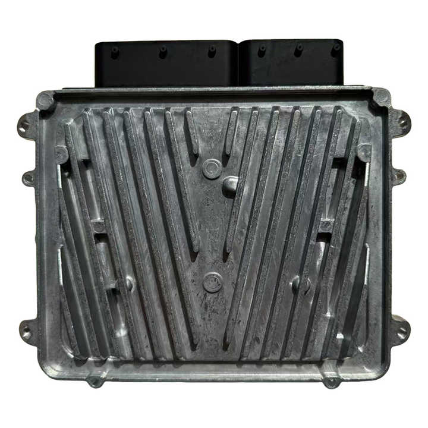
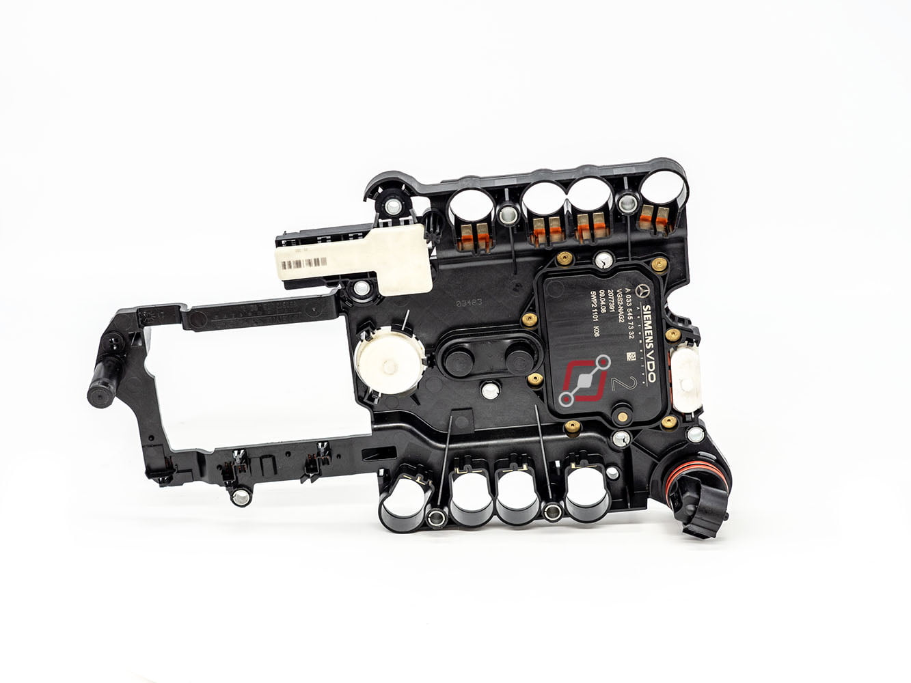
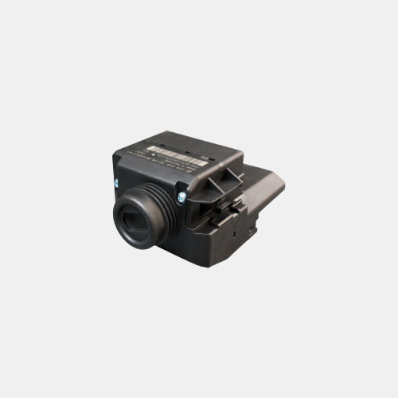
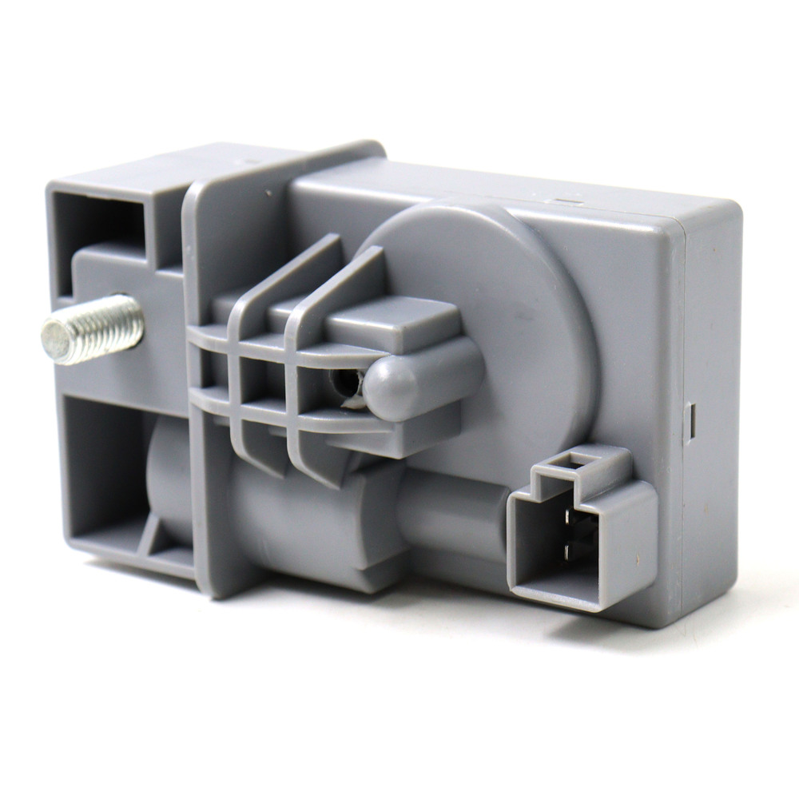
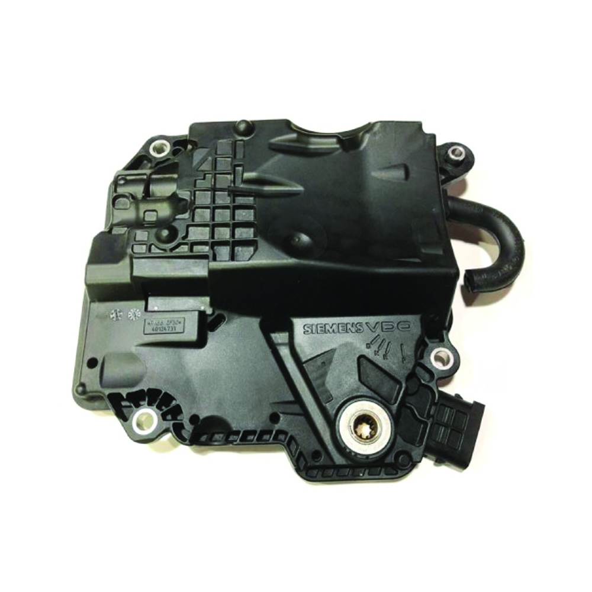
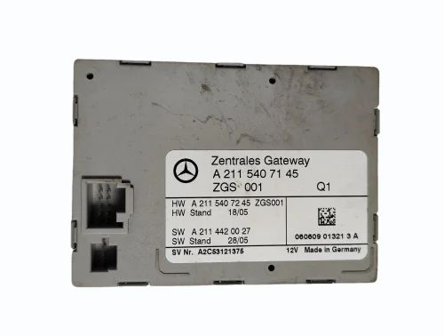
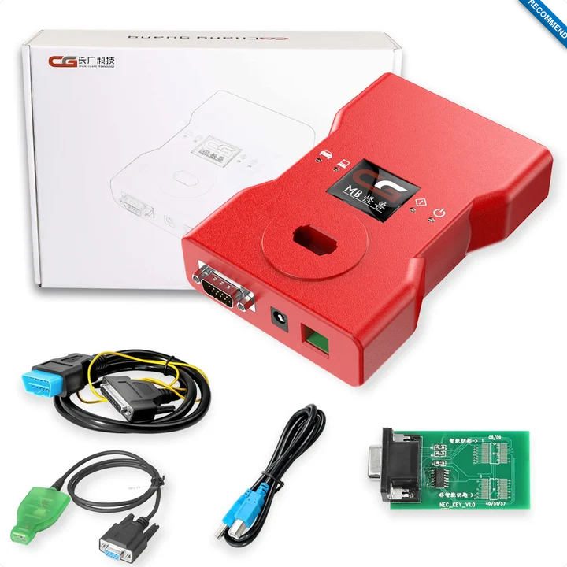

# Introduction

Modern Mercedes‑Benz vehicles are packed with **electronic modules** that control nearly every system in the car. From the engine and transmission to the steering lock and instrument cluster, each module communicates via a complex network. With professional diagnostic and programming tools, you can **read, test, diagnose, and even program many of these modules**, not just keys.

This guide covers two professional tools:

- **Mercedes‑Benz Full Test Platform Pro (MK3 tool)**  
  A professional **Mercedes module bench tester** supporting FAST Calculation (FBS4), EZS/EIS, ECUs, TCU/VGS, ISM, dashboards, and steering locks (ELV/ESL).  
  It is compatible with Xhorse VVDI MB Tool, Xhorse VVDI Key Tool Plus Pad, ABRITES, AUTEL, and CGDI MB. ([Official MK3 page](https://www.mk3.com/en/mercedes-benz-full-test-platform-pro))

- **CGDI Prog MB Benz Key Programmer**  
  A versatile key programming tool that can **read EIS/EZS, program keys, calculate passwords**, and even interact with other modules. ([Official CGDI page](https://www.cgdiprog.com/products/cgdi-prog-mb-benz-key-programmer.html))

---

## What You’ll Learn

By following this guide, you will:

- Understand the role of each Mercedes module and what it controls
- Safely connect these tools to the car or individual modules
- Perform **module testing, password reading, key programming, and firmware renewals**
- Troubleshoot issues and interpret results
- Use reference manuals for advanced operations

---

## Key Mercedes Modules You Can Work With

| Module        | What It Does                                                      | What You Can Do With Tools                                               | Image                           |
| ------------- | ----------------------------------------------------------------- | ------------------------------------------------------------------------ | ------------------------------- |
| **ECU**       | Engine Control Unit – manages fuel, ignition, emissions           | Read data, test sensors, reprogram ECU functions                         |           |
| **TCU / VGS** | Transmission Control Unit – controls automatic gear shifts        | Test adaptive values, reset learned behavior, reprogram shifting logic   |           |
| **EIS / EZS** | Electronic Ignition Switch – authorizes keys, manages immobilizer | Read module info, calculate passwords, program new keys, reset functions |           |
| **ELV / ESL** | Steering Lock – prevents unauthorized starts                      | Test locking/unlocking, program replacement locks, emulate ELV/ESL       |           |
| **ISM**       | Intelligent Servo Module – gear selector control                  | Renew ISM, bench test, communication test                                |           |
| **Gateway**   | Central communication hub                                         | Diagnose network, update firmware, configure module communication        |  |

> **Note:** The MK3 Full Test Platform Pro includes **built-in ELV/ESL emulators**, allowing you to test EIS/EZS even without the original steering lock. This is critical when performing bench testing or module repair.

---

## Overview of Tools

**Mercedes‑Benz Full Test Platform Pro**

- Bench test EIS/EZS, ELV/ESL, dashboards, TCU/VGS, ECUs
- Built-in steering lock emulator for W204/W207
- Supports old and new EZS/EIS units (Motorola and NEC)
- Compatible with multiple programming tools: Xhorse VVDI, ABRITES, CGDI MB, AUTEL
- Supports FAST calculation for all FBS3/FBS4 modules
- No additional kit required; full cable set included

_MK3 Full Test Platform Pro – supports EZS/EIS, ELV/ESL, dashboards, ECUs, TCU, ISM_

**CGDI Prog MB Benz Key Programmer**

- Fastest Mercedes key add: 1’50’’ collection time, 40s password calculation
- Supports both BE keys and original keys
- Works with “all keys lost” scenarios for a wide range of models
- Supports ECU renew (ME9.7, MED17, CR3.xx, CR4.xx, CR5, CR60.xx, CRD.xx, SIM series)
- Gearbox renew supported for EGS 7G
- Infrared diode upgrade improves keyless GO programming
- Lifetime online software updates, multi-language support
- Supports mileage repair and gateway read/write authorization

  
_CGDI Prog MB – key programmer, EIS/EZS reading & writing, password calculation_

---

With this foundation, the rest of the book will guide you through **step-by-step testing, programming, and module operations** using these tools, along with **screenshots, diagrams, and reference manuals** for advanced work.
