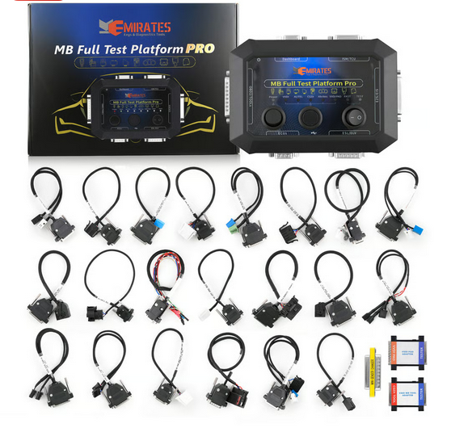
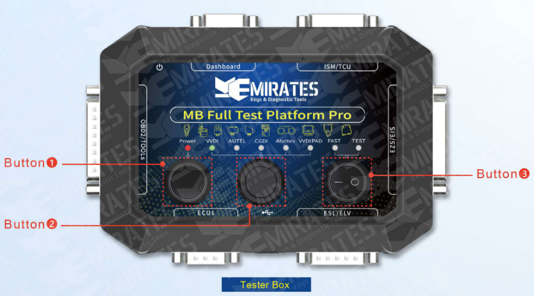
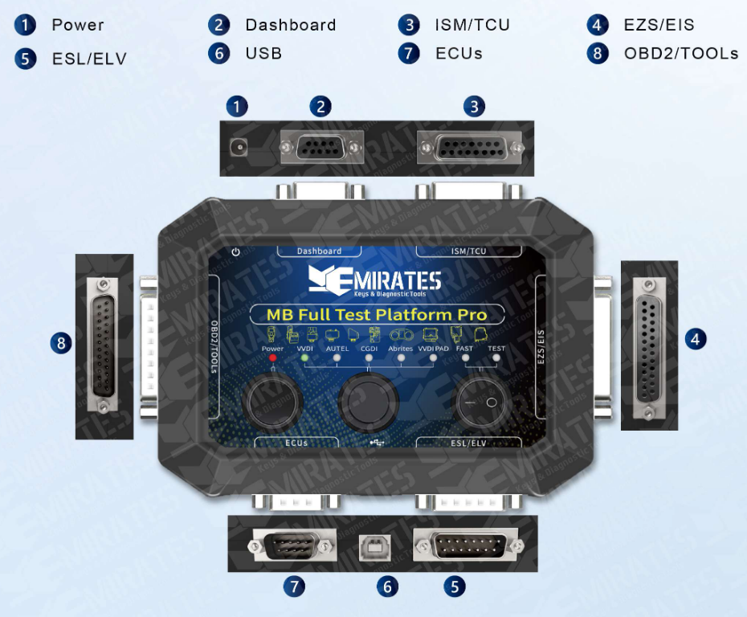
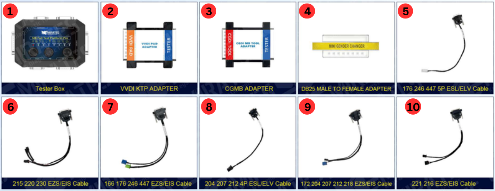

# Mercedes-Benz Full Test Platform Pro (MK24712)

The **Mercedes-Benz Full Test Platform Pro** is a professional **on-bench testing, diagnostic, and programming platform** designed specifically for Mercedes-Benz electronic control units.

Unlike basic key programmers, this tool allows you to **power, simulate, test, and interact with multiple Mercedes modules outside the vehicle**, making it essential for repair, diagnostics, renewals, and advanced programming work.

    
_Figure 3.1: Mercedes-Benz Full Test Platform Pro – supports EZS/EIS, ELV/ESL, dashboards, ECUs, TCU, ISM_

---

## What This Tool Is Designed For

The Full Test Platform Pro is built to:

- Bench-test Mercedes control units **without the car**
- Simulate missing modules (ELV/ESL, Gateway)
- Work with **multiple aftermarket programming tools**
- Support **FBS3 and FBS4 systems** with FAST calculation
- Provide a safe environment for diagnostics and module repair

---

## Front Panel – Physical Buttons

The Mercedes-Benz Full Test Platform Pro has **three physical buttons** on the front panel. These buttons control **power, module routing, and operating mode**.

    
_Figure 3.2: MK3 Front Panel with Buttons_

---

### ॰ Button 1 (Power)

**Function:**

- Turns the test platform **ON / OFF**

**Usage Notes:**

- Must be **OFF** before connecting or disconnecting any module or cable
- Power ON only after all cables are connected correctly
- Power OFF before changing device mode or pin-out cables

> ⚠️ Never hot-plug modules while the platform is powered ON.

---

### ॰ Button 2 (Device Switch)

**Function:**

- Selects the **active programming tool interface**
- Routes communication and signal lines to match the selected programmer

**Device Interfaces:**

- VVDI
- AUTEL
- CGDI
- ABRITES
- VVDI PAD

**Atention!** Different device have **different protocols**, selecting the correct device is mandatory for successful communication.

**Usage Notes:**

- Always select the device interface that matches the connected programming tool
- Using the wrong device interface may result in:
  - No communication
  - Incorrect voltage routing
  - Programming failure

---

### ॰ Button 3 (FAST / TEST)

**Function:**

- Switches between **FAST mode** and **TEST mode**

**FAST Mode:**

- Enables **FAST calculation** for [FBS3](./explanations/fbs/fbs.md) and [FBS4](./explanations/fbs/fbs4.md) systems
- Used for:
  - EIS / EZS password calculation
  - Data collection
  - Key programming support
  - Security-related operations

**TEST Mode:**

- Used for **bench testing and diagnostics**
- Powers modules for:
  - Communication testing (e.g, Simulating ELV/ESL behavior)
  - Module verification
  - Renew and repair operations

## Side Panel – D-Subminiature (DB) Connector Details

The Test platform has **6 positions** to insert DB cable and **2 positions** for power and USB.
Which is convenient for users to connect any control unit together and complete programming.

    
_Figure 3.3: MK3 Side Panel with DB Connectors_

### Connector Functions

Based on the numbered legend in [Figure 3.3](#figure-33-mk3-side-panel-with-db-connectors), here is a breakdown of what each port does:

| No. | Label        | Function & Purpose                                                                                                                                                                     |
| --- | ------------ | -------------------------------------------------------------------------------------------------------------------------------------------------------------------------------------- |
| 1   | Power        | The DC input port. This provides the necessary 12V power to the platform and all connected Mercedes modules.                                                                           |
| 2   | Dashboard    | A DB9/DB15 style port used to connect the vehicle's Instrument Cluster. This allows you to check for mileage, warning lights, or communication errors on the bench.                    |
| 3   | ISM / TCU    | Used for the Intelligent Servo Module (gear shifter) or Transmission Control Unit. Essential for **virginizing** or personalizing transmission components.                             |
| 4   | EZS / EIS    | This connects to the Electronic Ignition Switch. This is the **brain** of the Mercedes security system where the key is inserted.                                                      |
| 5   | ESL / ELV    | Connects to the Electronic Steering Lock. This is used to test if the steering lock is synchronizing properly with the key and ignition.                                               |
| 6   | USB          | A Type-B USB port used to connect the platform to a computer for firmware updates or to interface with diagnostic software.                                                            |
| 7   | ECUs         | Used to connect the Engine Control Unit. This is vital for testing the drive authorization system (FBS3/FBS4) to ensure the engine will actually start.                                |
| 8   | OBD2 / TOOLS | This is the main interface for your diagnostic tools (like VVDI, Autel, Abrites, or CGDI). It acts as the bridge between your programmer and the modules connected to the other ports. |

### Connector Cables and Adapters

- VVDI KTP Adapter
- CGMB Adapter
- DB25 Male to Female Adapter
- 176 246 447 5P ESL/ELV Cable
- 215 220 230 EZS/EIS Cable
- 166 176 246 447 EZS/EIS Cable
- 204 207 212 4P ESL/ELV Cable
- 172 204 207 212 218 EZS/EIS Cable
- 221 216 EZS/EIS Cable
- 202 208 210 5P ESL/ELV Cable
- 203 3P ESL/ELV Cable
- 169 245 209 211 171 EZS/EIS Cable
- 169 245 4P ESL/ELV Cable
- ECUs Cable
- 202 208 210 EZS/EIS Cable
- 906 Sprinter Crafter EZS/EIS Cable
- Dashboard Cable
- ISM Cable
- 7G/VGS Cable
- 205 222 EZS/EIS Cable
- 203 463 639 Vito EZS/EIS Cable
- 164 251 EZS/EIS Cable
- 203 209 211 219 639 906 5P ESL/ELV Cable
- OBD Cable

## Why This Tool Matters

The Mercedes-Benz Full Test Platform Pro is not just a tester — it is a **controlled environment** for safely working with Mercedes security and control modules. It reduces risk, speeds up diagnostics, and makes complex module operations possible **without the vehicle present**.
